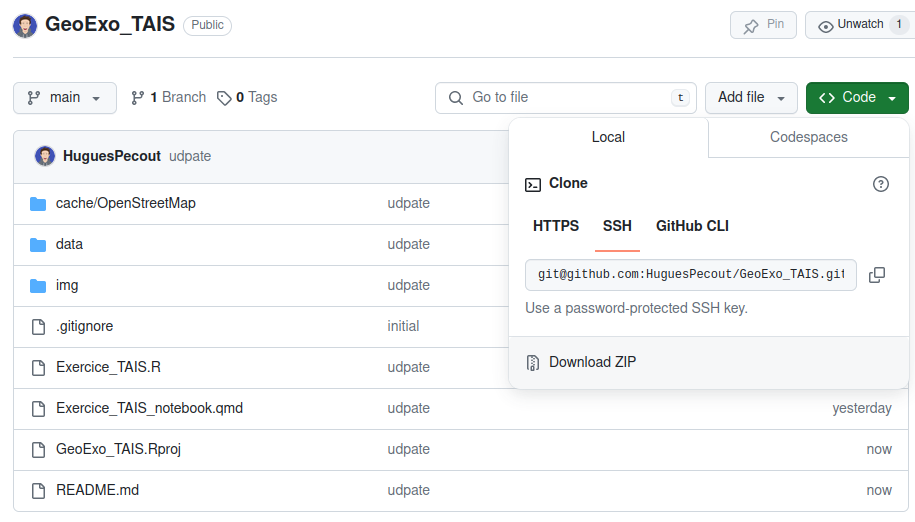
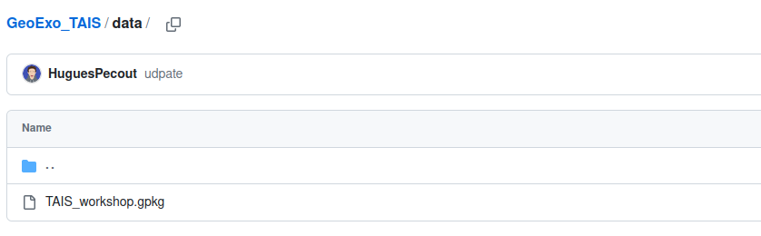
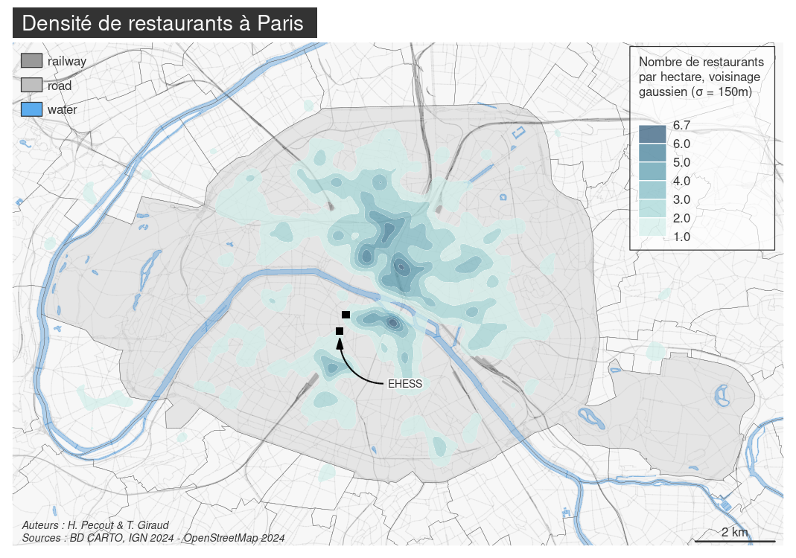

# Traitement et analyse de l’IG avec R 

### Séminaire EHESS TAIS 2023-2024

*Hugues Pecout (CNRS, UMR Géographie-Cités) & Timothée Giraud (CNRS, UAR RIATE)*

 

#### **A. Diaporama d'introduction**

:warning: Accessible en ligne à ce 
[**lien**](https://tais-ehess-hpecout-bb467c23dd2ecba666035579bc786d99e7bb2c2b3553.gitpages.huma-num.fr/#/title-slide).

 

#### **B. Téléchargement de l’espace de travail**

Un projet Rstudio est téléchargeable à ce lien : [**https://github.com/HuguesPecout/GeoExo_TAIS**](https://github.com/HuguesPecout/GeoExo_TAIS)

Téléchargez le dépot zippé ("*Download ZIP*") **GeoExo_TAIS** sur votre machine.   

 

Une fois le dossier dézippé, lancez le projet Rstudio en double-cliquant sur le fichier **GeoExo_TAIS.Rproj**.

 

#### **C. Les données à disposition**

Le fichier de données est mis à disposition dans le répertoire **data**.

**Le fichier GeoPackage** (**GeoSenegal.gpkg**) contient 8 couches géographiques :

- **paris** : Couche des arrondissments de la commune de Paris. Source : BD CARTO IGN, 2014    
- **commune** : Couche des communes environnantes de Paris. Source : BD CARTO IGN, 2014   
- **troncon_routier** : Couche des tronçons routiers (Paris & environs). Source : BD CARTO IGN, 2014    
- **voie_ferree** : Couche des voies ferrées (Paris & environs). Source : BD CARTO IGN, 2014    
- **surface_hydro** : Couche des surface hydrographiques (Paris & environs). Source : BD CARTO IGN, 2014   

Trois d'entre-elles sont générées par le script "*Exercice_TAIS.R*" :

- **restaurant_osm** : Couche des restaurants (Paris & environs). Source : OpenStreetMap, 2014   
- **etab_esr** : Couche contenant la localisation de l'EHESS et de SciencePo (résultat géocodage)    
- **grid500m_paris** : Grille régulière (500m) vectorielle sur l'emprise de Paris  

 

####  **D. Exercice**

**L'ensemble des fonctionnalités utilisées sont présentées dans les manuels [Geomatique avec R](https://rcarto.github.io/geomatique_avec_r/) et [Cartographie avec R](https://rcarto.github.io/cartographie_avec_r/).**

 

**Déroulé de la chaîne de traitement présentée :**

- **A.** Import de données & récupération de données OSM

- **B.** Exploration I - Répartition des restaurants

- **C.** Exploration II - Accessibilité aux restaurants

 

 
 

